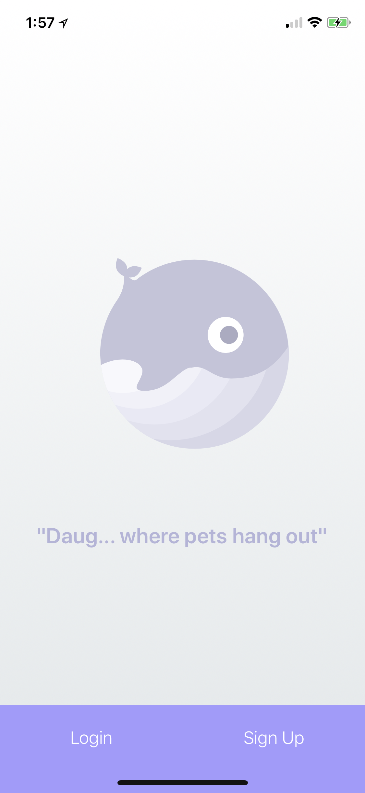
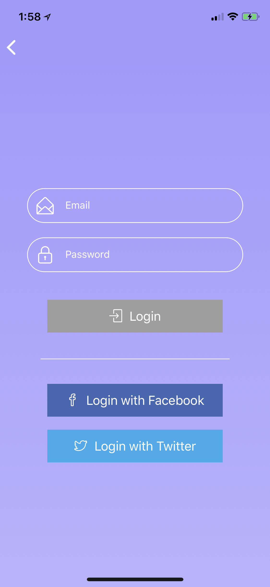
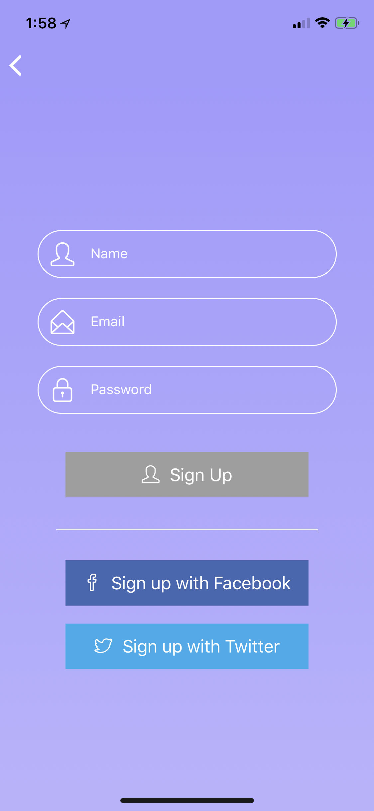
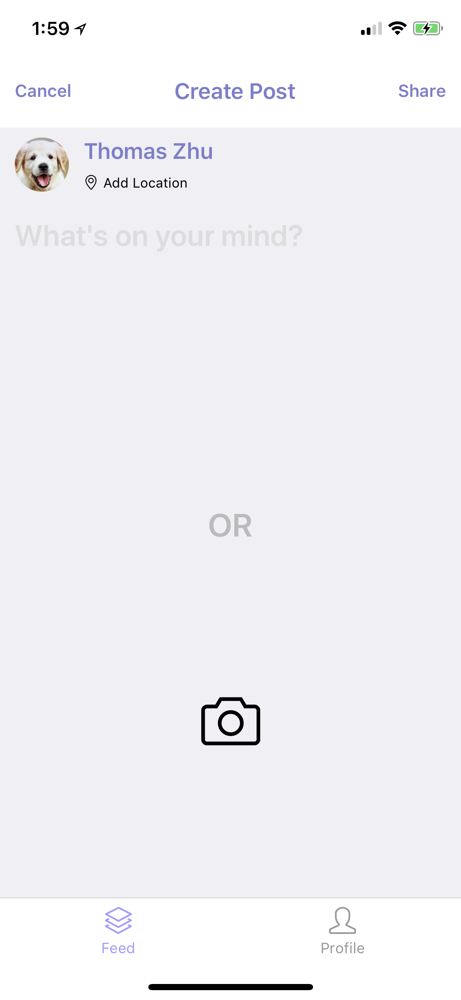
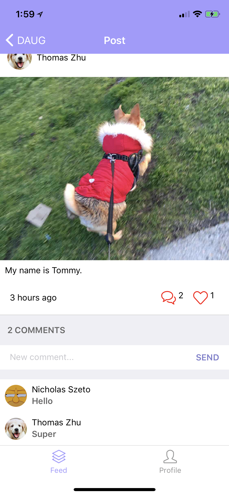
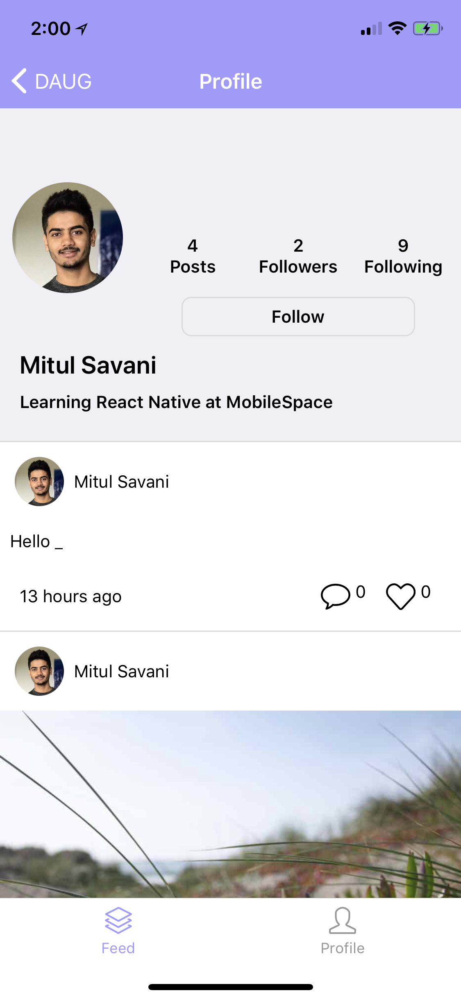
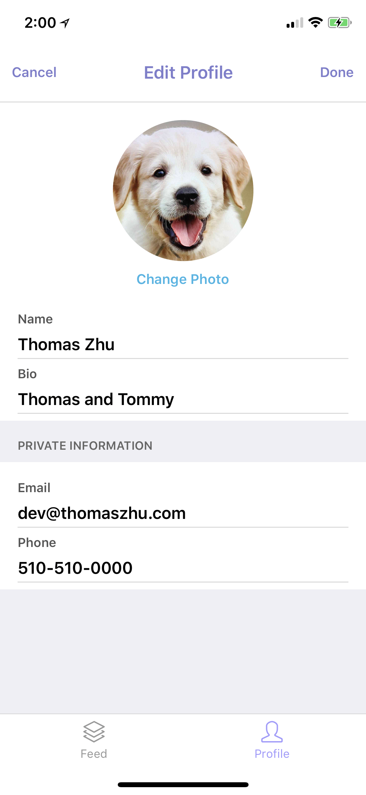
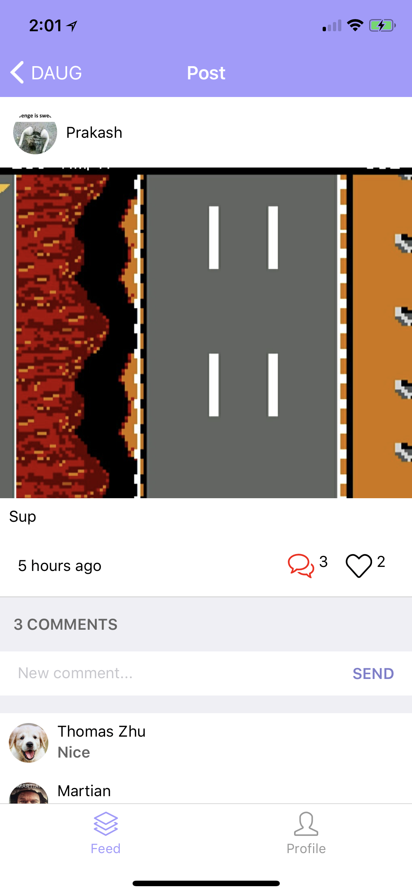

# Daug mobile app

This repo is the mobile app for Daug.


<p align="center">
  
  <br>(logo source: LottieFiles - https://www.lottiefiles.com/330-empty-status)
</p>

<h3 align="center">
  Daug
</h3>

<p align="center">
  Just a place where pets hang out...
</p>

## What's Daug?

**Daug is a social network for pets.**

- Your pets can **sign up or login** using their paws.
- They can **upload selfies** or **post their thoughts** for other pets to see.
- They can also look at **other pets posts** and either **paw** (like) or **scratch** (dislike) it.


<hr />

<div style={{ display: flex; flex-direction: row; justify-content: space-around }}>
  
  
  
</div>
<div style={{ display: flex; flex-direction: row; justify-content: space-around }}>
  
  
  
</div>
<div style={{ display: flex; flex-direction: row; justify-content: space-around }}>
  
  
  
</div>

### [Demo - Try it on Expo](https://expo.io/@thomashzhu/daug-mobile)

## Functionality
- Daug is a fully functioning Social Network app
- Users can Sign up & Log into the app
- Users can create a new Posts (text and/or picture)
- Users can like and comments on Posts
- Users can follow each other

## Getting started

```
git clone git@github.com:mobilespace/daug-mobile.git

exp start

exp ios
```

## Assignment #1

- [x] Design & build an Intro Screen
  - [x] :star: **Bonus:** Add [Snap Carousel](https://github.com/archriss/react-native-snap-carousel) with [Lottie animations](https://docs.expo.io/versions/latest/sdk/lottie.html) to Intro Screen
- [x] Design & build an Signup Screen
  - [x] :star: **Bonus:** Add buttons to sign up with Facebook & Twitter
- [x] Design & build an Login Screen
  - [x] :star: **Bonus:** Add buttons to login with Facebook & Twitter
- [x] Design & build an Profile Screen
  - [x] :star: **Bonus:** Add the Logout button
- [x] Design & build an Social Feed Screen with [Mock Data](https://raw.githubusercontent.com/mobilespace/daug-mobile/master/app/utils/constants.js?token=AHejrmtQeRKU4ntCxaYLoNiWDlF-kQdKks5am8vHwA%3D%3D)
- [x] Attach screenshots/gif of screens to `README.MD`

## Assignment #2

- [x] Understand the 3 main navigation patterns for mobile apps:
  - [x] [StackNavigator](https://reactnavigation.org/docs/hello-react-navigation.html#creating-a-stacknavigator)
  - [x] [TabNavigator](https://reactnavigation.org/docs/tab-based-navigation.html)
  - [x] [DrawerNavigator](https://reactnavigation.org/docs/drawer-based-navigation.html)
- [x] Setup a **IntroStack** (using StackNavigator) for the Intro Screen (root), Login Screen (push) & Sign Up Screen (push)
- [x] Setup a **HomeTabs** (using TabNavigator) for the Social Feed Screen (default) and Profile Screen
- [x] Setup a **RootNavigator** (using StackNavigator) with the **IntroStack** & **HomeTabs** with `mode: "modal"`
- [x] Design & build an Edit Profile Screen
- [x] Setup a **ProfileStack** (using StackNavigator) for the Profile Screen (root), Post Details Screen (push) & Edit Profile Screen (modal) with mode: "modal" and custom RNE header component
- [x] Design & build a Post Details Screen
- [x] Design & build a Create Post Screen
- [x] Setup a **SocialStack** (using StackNavigator) for the Social Feed Screen (root), Post Details Screen (push) & Create Post Screen (modal) with mode: "modal" and custom RNE header component
- [x] :star: **Bonus:** Display Posts on ProfileScreen
- [ ] :star: **Bonus:** Setup a **HomeNavigator**(using DrawerNavigator) with the **HomeTabs** (as root) and update **RootNavigator** to use **HomeNavigator** instead of **HomeTabs**
- [x] Add working gif of app to `README.MD`

## Assignment #3

- [x] Intro Screen - Make simple **`GET`** request to **`/api`** to check server status
- [x] Signup Screen - Make **`POST`** request to **`/auth/signup`** to create a new user
	- [x] :star: **Bonus:** Add UI validation to Signup Screen - name (not null), email (format) & password (min. 8 characters)
- [x] Login Screen - Make **`POST`** request to **`/auth/login`** to validate and login an existing user
	- [x] :star: **Bonus:** Add UI validation to Login Screen - email (format) & password (min. 8 characters)
- [x] Social Feed Screen - Make **`GET`** request to **`/api/feed/`** to get all posts for social feed
	- [x] :star: **Bonus:** Use `ActivityIndicator` to show placeholder loading when fetching feed data
	- [x] :star: **Bonus:** Use `DeviceEventEmitter` to trigger fetching posts when the `new_post_created` event is emitted
	- [x] :star: **Bonus:** Use `timeSince()` utility function to show relative times for post creation
- [x] Create Post Screen - Make **`POST`** request to **`/api/users/:userId/posts`** to create a new post by the user
	- [x] :star: **Bonus:** Use `DeviceEventEmitter` to emit `new_post_created` event once post is created
- [x] Profile Screen - Make **`GET`** request to **`/api/users/:userId`** to get all the profile data
	- [x] :star: **Bonus:** Use `ActivityIndicator` to show placeholder loading when fetching profile data
	- [x] :star: **Bonus:** Use `DeviceEventEmitter` to trigger fetching profile data when the `user_profile_updated` event is emitted
- [x] Edit Profile Screen - Make **`PUT`** request to **`/api/users/:userId`** to update a user's profile information
	- [x] :star: **Bonus:** Use `DeviceEventEmitter` to emit `user_profile_updated` event once user data is updated
- [x] Setup Authentication flow for app using `AsyncStorage`. Once the user has logged in then take them to home page each time they open the app again
- [x] Use Redux to share state between tab bar & screens
- [x] Add working gif of app to `README.MD`

## Wrap up

- [x] Add Like, Comment and Follow API functionality
- [x] Clean up and format `README.MD` to showcase app - [follow this template](https://github.com/mobilespace/MobileGuides/blob/master/showcase_app_readme.md#readme-template-for-showcasing-a-mobile-app)
- [x] :star: **Bonus:** Add phone number UI to Edit Profile screen
- [x] :star: **Bonus:** Add Camera functionality to Create Post screen
- [x] :star: **Bonus:** Use Redux to share state between tab bar & screens
- [x] Add working gif of app to `README.MD`

## Feedback

Please fork it and play with it. In case you have any feedback, feel free to open a new issues on this repo or reach out to me [**@thomashzhu**](https://github.com/thomashzhu).