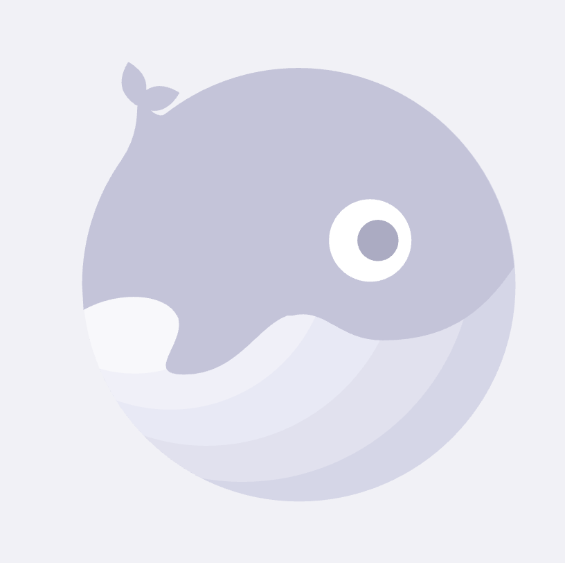
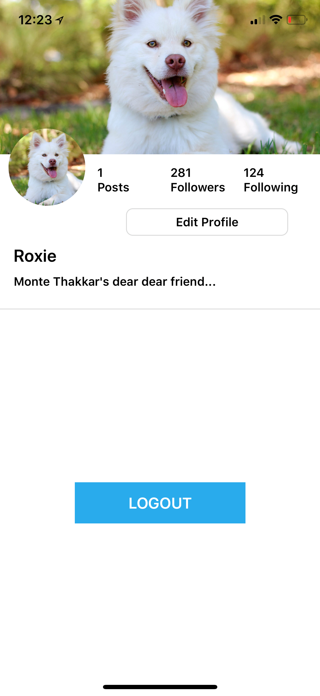

# Daug mobile app

This repo is the mobile app for Daug.


<p align="center">
  
  <br>(logo source: LottieFiles - https://www.lottiefiles.com/330-empty-status)
</p>

<h3 align="center">
  Daug
</h3>

<p align="center">
  Just a place where pets hang out...
</p>

## What's Daug?

**Daug is a social network for pets.**

- Your pets can **sign up or login** using their paws.
- They can **upload selfies** or **post their thoughts** for other pets to see.
- They can also look at **other pets posts** and either **paw** (like) or **scratch** (dislike) it.


<hr />

<div style={{display: flex; flex-direction: row}}>
  
  
  
</div>
<div style={{display: flex; flex-direction: row}}>
  
  
  
</div>
<div style={{display: flex; flex-direction: row}}>
  
  
  
</div>

### [Demo - Try it on Expo](https://expo.io/@thomashzhu/daug-mobile)

## Functionality
- Daug is a fully functioning Social Network app
- Users can Sign up & Log into the app
- Users can create a new Posts (text and/or picture)
- Users can like and comments on Posts
- Users can follow each other

## Getting started

```
git clone git@github.com:mobilespace/daug-mobile.git

exp start

exp ios
```

## Assignment #1

### Objectives

- Learn how to build & organize screens in RN
- Learn advanced RN styling and use LinearGradient, Image, Icons & Custom Fonts
- Learn how to use mock data for prototyping UI screens
- Learn how to use NPM libaries such as React Native Elements, Expo & React Native Vector Icons

## Designs

Intro, Login & Sign up screen based on Robinhood App.

Profile screen based on Instagram.

Social feed screen based on Facebook.

### Other design ideas

- [Login screen designs on Pinterest](https://www.pinterest.com/timoa/mobile-ui-logins/?lp=true)
- [Mobile UI on Dribble](https://dribbble.com/search?q=mobile+UI)
- [Instagram UI kit - Sketch file](https://www.sketchappsources.com/free-source/2023-instagram-based-ui-kit-sketch-freebie-resource.html)

### TODO

- [x] Design & build an Intro Screen
  - [x] :star: **Bonus:** Add [Snap Carousel](https://github.com/archriss/react-native-snap-carousel) with [Lottie animations](https://docs.expo.io/versions/latest/sdk/lottie.html) to Intro Screen
- [x] Design & build an Signup Screen
  - [x] :star: **Bonus:** Add buttons to sign up with Facebook & Twitter
- [x] Design & build an Login Screen
  - [x] :star: **Bonus:** Add buttons to login with Facebook & Twitter
- [x] Design & build an Profile Screen
  - [x] :star: **Bonus:** Add the Logout button
- [x] Design & build an Social Feed Screen with [Mock Data](https://raw.githubusercontent.com/mobilespace/daug-mobile/master/app/utils/constants.js?token=AHejrmtQeRKU4ntCxaYLoNiWDlF-kQdKks5am8vHwA%3D%3D)
- [x] Attach screenshots/gif of screens to `README.MD`

### Demo
<br />Intro Screen (with Carousel)
<div style={{display: flex; flex-direction: row}}>
  
  
</div>
<br />Login & Sign up
<div style={{display: flex; flex-direction: row}}>
  
  
</div>
<br />Facebook & Twitter Auth
<div style={{display: flex; flex-direction: row}}>
  
  
</div>
<br />Social Feed & Profile
<div style={{display: flex; flex-direction: row}}>
  
  
</div>

## Assignment #2

### Objectives

- Learn how to build navigation for Daug app using [React Navigation](https://reactnavigation.org/)
- Learn mobile design patterns for navigation & screen layouts
- Learn how to quickly build RN screens and hook them up using navigation

### TODO

- [x] Understand the 3 main navigation patterns for mobile apps:
  - [x] [StackNavigator](https://reactnavigation.org/docs/hello-react-navigation.html#creating-a-stacknavigator)
  - [x] [TabNavigator](https://reactnavigation.org/docs/tab-based-navigation.html)
  - [x] [DrawerNavigator](https://reactnavigation.org/docs/drawer-based-navigation.html)
- [x] Setup a **IntroStack** (using StackNavigator) for the Intro Screen (root), Login Screen (push) & Sign Up Screen (push)
- [x] Setup a **HomeTabs** (using TabNavigator) for the Social Feed Screen (default) and Profile Screen
- [x] Setup a **RootNavigator** (using StackNavigator) with the **IntroStack** & **HomeTabs** with `mode: "modal"`
- [x] Design & build an Edit Profile Screen
- [x] Setup a **ProfileStack** (using StackNavigator) for the Profile Screen (root), Post Details Screen (push) & Edit Profile Screen (modal) with mode: "modal" and custom RNE header component
- [x] Design & build a Post Details Screen
- [x] Design & build a Create Post Screen
- [x] Setup a **SocialStack** (using StackNavigator) for the Social Feed Screen (root), Post Details Screen (push) & Create Post Screen (modal) with mode: "modal" and custom RNE header component
- [x] :star: **Bonus:** Display Posts on ProfileScreen
- [ ] :star: **Bonus:** Setup a **HomeNavigator**(using DrawerNavigator) with the **HomeTabs** (as root) and update **RootNavigator** to use **HomeNavigator** instead of **HomeTabs**
- [x] Add working gif of app to `README.MD`

### Demo
<br />Home Tab and Profile Tab
<div style={{display: flex; flex-direction: row}}>
  
  
</div>
<br />Post Detail Screens
<div style={{display: flex; flex-direction: row}}>
  
  
</div>
<br />Modal Screens
<div style={{display: flex; flex-direction: row}}>
  
  
</div>
<br />
Miscellaneous (Separate comment and liked status)
<div style={{display: flex; flex-direction: row}}>
  
</div>
Miscellaneous (Log out)
<div style={{display: flex; flex-direction: row}}>
  
</div>

## Assignment #3

### Objectives

- Learn how to make backend API calls and User Authentication
- Learn how to setup and use Redux and AsyncStorage
- Serve as an React Native app that you can showcase on your porfolio

#### URL: [https://daug-app.herokuapp.com](https://daug-app.herokuapp.com)

### API

- `/api` => `GET` => Used to check API endpoint status
  	- `/users/all` => `GET` => Lists of all users
  	- `/posts/all` => `GET` => Lists of all posts
  	- `/users/:userId` => `GET` => Returns a user
  	- `/users/:userId` => `PUT` => Updates a user
  	- `/posts/:postId` => `GET` => Returns a post
  	- `/posts/:postId` => `POST` => Creates a post
  	- `/posts/:postId` => `PUT` => Updates a post
  	- `/posts/:postId` => `DELETE` => Deletes a post
  	- `/feed` => `GET` => Returns the Social Feed
- `/auth` => `GET` => Used to check AUTH endpoint status
  - `/signup` => `POST` = `( name, email, password )` => Used to create a new user
  - `/login` => `POST` = `( email, password )` => Used to validate an existing user

### TODO

- [x] Intro Screen - Make simple **`GET`** request to **`/api`** to check server status
- [x] Signup Screen - Make **`POST`** request to **`/auth/signup`** to create a new user
	- [x] :star: **Bonus:** Add UI validation to Signup Screen - name (not null), email (format) & password (min. 8 characters)
- [x] Login Screen - Make **`POST`** request to **`/auth/login`** to validate and login an existing user
	- [x] :star: **Bonus:** Add UI validation to Login Screen - email (format) & password (min. 8 characters)
- [x] Social Feed Screen - Make **`GET`** request to **`/api/feed/`** to get all posts for social feed
	- [x] :star: **Bonus:** Use `ActivityIndicator` to show placeholder loading when fetching feed data
	- [x] :star: **Bonus:** Use `DeviceEventEmitter` to trigger fetching posts when the `new_post_created` event is emitted
	- [x] :star: **Bonus:** Use `timeSince()` utility function to show relative times for post creation
- [x] Create Post Screen - Make **`POST`** request to **`/api/users/:userId/posts`** to create a new post by the user
	- [x] :star: **Bonus:** Use `DeviceEventEmitter` to emit `new_post_created` event once post is created
- [x] Profile Screen - Make **`GET`** request to **`/api/users/:userId`** to get all the profile data
	- [x] :star: **Bonus:** Use `ActivityIndicator` to show placeholder loading when fetching profile data
	- [x] :star: **Bonus:** Use `DeviceEventEmitter` to trigger fetching profile data when the `user_profile_updated` event is emitted
- [x] Edit Profile Screen - Make **`PUT`** request to **`/api/users/:userId`** to update a user's profile information
	- [x] :star: **Bonus:** Use `DeviceEventEmitter` to emit `user_profile_updated` event once user data is updated
- [x] Setup Authentication flow for app using `AsyncStorage`. Once the user has logged in then take them to home page each time they open the app again
- [x] Use Redux to share state between tab bar & screens
- [x] Add working gif of app to `README.MD`

## Wrap up

### Objectives

- Add UI polish, tie up loose end and add remaining functionality
- Update Readme with app details and publish Expo app for demo
- Serve as an React Native app that you can showcase on your porfolio

### TODO
- [x] Add Like, Comment and Follow API functionality
- [x] Clean up and format `README.MD` to showcase app - [follow this template](https://github.com/mobilespace/MobileGuides/blob/master/showcase_app_readme.md#readme-template-for-showcasing-a-mobile-app)
- [x] :star: **Bonus:** Add phone number UI to Edit Profile screen
- [x] :star: **Bonus:** Add Camera functionality to Create Post screen
- [x] :star: **Bonus:** Use Redux to share state between tab bar & screens
- [x] Add working gif of app to `README.MD`

## Submission

Once you have completed the assignment, please create a new issue on this repo with the title as your name and add the link to your repo in the description. One of the TA's will review your code and add your name to the list of completed submissions below if all looks good.

### Completed submissions

- [ ] Ryan Liszewski
- [ ] Thomas Zhu
- [ ] Bhavesh Chowdhury
- [ ] Sukhjit Singh
- [ ] Prakash Gurung
- [ ] Nicholas Szeto
- [ ] Emanuel Saunders
- [ ] William Hua
- [ ] Mitul Savani
- [ ] Jakhongir Khusanov
- [ ] Teodora Caneva
- [ ] Affaan Ghazzali
- [ ] Girish Rawat
- [ ] Karan Gupta

## Problems?

In case you run into any problems or issues, please post it on #questions channel on the MobileSpace Slack.

## Finally

For any other questions about this repo or MobileSpace in general please reach out to [**@monte9**](https://github.com/monte9) on Github.

